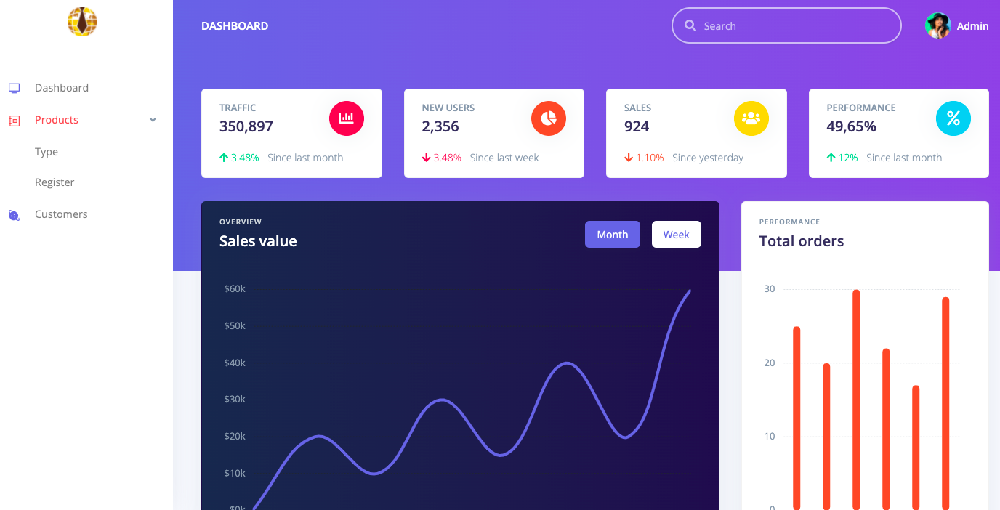

<h1 align="center">
 
LARAVEL / MYSQL FULL APP - LOGIN - LIST - CRUD
</h1>

This demonstration will show just a simple APP but full with login, lists and crud.

  
  
  
  
  

## Features
- **PHP**
- **Laravel**
- **SASS**
- **JQUERY**
- **VUE**
- **MYSQL**

## Getting started

- run the command: npm i
- open the command line of your MYSQL and run the script: storeDump.sql
- change your mysql credentials on config/database.php
- php run de command: php artisan serve
